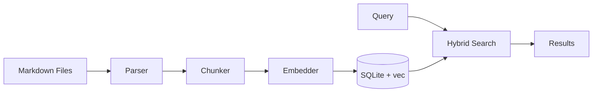

# Librarian

A markdown document management system with vector and full-text search, built on [Arcade](https://arcade.dev) for the Model Context Protocol (MCP).

## Overview

Librarian indexes markdown files and provides semantic search through MCP tools. It combines vector similarity search with full-text keyword search for accurate retrieval.



## Features

- SQLite storage with `sqlite-vec` for vector search
- Full-text search using FTS5 with BM25 ranking
- Hybrid search combining vector and keyword matching
- Max Marginal Relevance (MMR) for diverse results
- Configurable embedding models via sentence-transformers
- Header-aware text chunking with overlap
- Time-bounded search filters
- CLI and MCP server interfaces

## Installation

```bash
git clone https://github.com/ArcadeAI/librarian.git
cd librarian
./setup.sh
```

Or install manually:

```bash
uv pip install -e ".[dev]"
```

## CLI Usage

```bash
# Initialize current directory
libr init

# Add a document source
libr sources add ~/notes --name "Notes"

# Index documents
libr docs index

# Search
libr search "machine learning concepts"

# List indexed documents
libr docs list
```

## MCP Server

Start the server for AI assistant integration:

```bash
# stdio transport (Claude Desktop, CLI)
libr serve stdio

# HTTP transport (Cursor, VS Code)
libr serve http --port 8000
```

See the [Arcade MCP documentation](https://docs.arcade.dev) for integration details.

### Available Tools

| Tool | Description |
|------|-------------|
| `Librarian_Search` | Hybrid vector + keyword search with MMR |
| `Librarian_VectorSearch` | Pure semantic similarity search |
| `Librarian_KeywordSearch` | Full-text keyword search |
| `Librarian_IngestDirectory` | Index markdown files from a directory |
| `Librarian_AddDocument` | Create a new document |
| `Librarian_UpdateDocument` | Update document content |
| `Librarian_ReadDocument` | Read document content |
| `Librarian_DeleteDocument` | Remove from index |
| `Librarian_ListDocuments` | List indexed documents |
| `Librarian_GetStats` | Index statistics |

## Configuration

Set via environment variables:

| Variable | Default | Description |
|----------|---------|-------------|
| `DOCUMENTS_PATH` | `./documents` | Root directory for markdown files |
| `DATABASE_PATH` | `~/.librarian/index.db` | SQLite database location |
| `EMBEDDING_MODEL` | `all-MiniLM-L6-v2` | Sentence transformer model |
| `CHUNK_SIZE` | `512` | Max characters per chunk |
| `CHUNK_OVERLAP` | `50` | Overlap between chunks |
| `SEARCH_LIMIT` | `10` | Default results limit |
| `MMR_LAMBDA` | `0.5` | MMR diversity (0=diverse, 1=relevant) |
| `HYBRID_ALPHA` | `0.7` | Vector vs keyword weight (1=vector only) |

## Project Structure

```
librarian/
├── cli.py           # Command-line interface
├── server.py        # MCP server and tool definitions
├── config.py        # Configuration management
├── timeframe.py     # Time filter utilities
├── storage/
│   ├── database.py  # SQLite operations
│   ├── vector_store.py  # sqlite-vec search
│   └── fts_store.py     # FTS5 search
├── processing/
│   ├── parser.py    # Markdown parsing
│   ├── chunker.py   # Text chunking
│   └── embedder.py  # Embedding generation
└── retrieval/
    └── search.py    # Hybrid search + MMR
```

## Development

```bash
make install    # Install dependencies
make test       # Run tests
make lint       # Run linter
make format     # Format code
make typecheck  # Type checking
make check      # All checks
```

## Resources

- [Arcade.dev](https://arcade.dev) - Build AI-native applications
- [Arcade Documentation](https://docs.arcade.dev) - Integration guides and API reference

## License

MIT License - see [LICENSE](LICENSE) for details.

## Contact

- Email: contact@arcade.dev
- Website: [arcade.dev](https://arcade.dev)
