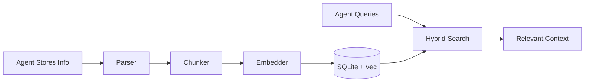

# Agent Library

A personal knowledge library for AI agents, built on [Arcade](https://arcade.dev) for the Model Context Protocol (MCP).

> **Status.** Agent Library is a community project built by Arcade.dev engineers. **It is not an official Arcade.dev product** and is not covered by Arcade.dev support or SLAs. See [Support](#support) below for what to expect.

> **Naming.** The package is **Agent Library** (`agent-library` on PyPI, `librarian` as the Python module). The MCP server inside it identifies itself as `Librarian` — that's the role your agent talks to, and it's why the exposed tools are named `Librarian_SearchLibrary`, `Librarian_AddToLibrary`, and so on.

## Overview

Agent Library provides AI agents with persistent storage for text, documents, and knowledge. Agents can store information and retrieve it later through semantic and keyword search, maintaining context across conversations.



## Features

- Persistent knowledge storage for AI agents
- SQLite storage with `sqlite-vec` for vector search
- Full-text search using FTS5 with BM25 ranking
- Hybrid search combining semantic and keyword matching
- Max Marginal Relevance (MMR) for diverse results
- Configurable embedding models (local or OpenAI-compatible API)
- Header-aware text chunking with overlap
- Time-bounded search filters
- CLI and MCP server interfaces

## Multi-Modal Support

Agent Library supports indexing and searching across multiple file types:

| Asset Type | File Extensions | Features |
|------------|----------------|----------|
| **Text** | `.md`, `.txt` | Frontmatter extraction, header-aware chunking |
| **Code** | `.py`, `.js`, `.ts`, `.go`, `.rs`, `.java`, `.cpp`, and more | Symbol extraction (classes, functions, methods) |
| **PDF** | `.pdf` | Page-based text extraction |
| **Image** | `.png`, `.jpg`, `.jpeg`, `.gif`, `.webp` | Metadata and EXIF extraction, optional OCR |

## Installation

The recommended way to install Agent Library is as a [uv tool](https://docs.astral.sh/uv/concepts/tools/), which gives you the `libr` CLI and the MCP server in an isolated environment:

```bash
uv tool install 'agent-library[all]'
```

The `[all]` extra pulls in optional support for PDFs, images, OCR, and code-aware embeddings. If you'd rather install only what you need:

```bash
uv tool install agent-library                # core only (text + code)
uv tool install 'agent-library[pdf]'         # add PDF support
uv tool install 'agent-library[vision]'      # add image support
uv tool install 'agent-library[ocr]'         # add OCR for image-based PDFs
```

### Installing from source

If you want to contribute or run from a clone:

```bash
git clone https://github.com/arcadeai-labs/agent-library.git
cd agent-library
./setup.sh
```

Or install manually with the dev extras:

```bash
uv pip install -e ".[dev,all]"
```

## CLI Usage

```bash
# Add files to the library
libr add ~/notes

# Search the library
libr search "machine learning concepts"

# List sources
libr list

# View library statistics
libr index

# Rebuild the index
libr index build
```

## MCP Server

Start the server for AI assistant integration:

```bash
# stdio transport (Claude Desktop, CLI)
libr serve stdio

# HTTP transport (Cursor, VS Code)
libr serve http --port 8000
```

See the [Arcade MCP documentation](https://docs.arcade.dev) for integration details.

### Available Tools

**Core Tools** (always enabled):

| Tool | Description |
|------|-------------|
| `Librarian_SearchLibrary` | Unified search with mode selection (hybrid/semantic/keyword), asset type filtering, and timeframe support |
| `Librarian_AddToLibrary` | Store new content in the library |
| `Librarian_UpdateLibraryDoc` | Update existing content |
| `Librarian_ReadFromLibrary` | Read full document content |
| `Librarian_RemoveFromLibrary` | Remove content from the library |
| `Librarian_ListLibraryContents` | List all stored content |
| `Librarian_IndexDirectoryToLibrary` | Bulk import files from a directory |

**Optional Tools** (enable with `LIBRARIAN_ENABLE_OPTIONAL_TOOLS=true`):

| Tool | Description |
|------|-------------|
| `Librarian_GetLibraryOverview` | Inspect the library — `view` selects `sections` (default; storage locations + doc counts), `stats` (totals + config), or `tree` (recursive filesystem walk) |
| `Librarian_SuggestLibraryLocation` | AI-powered suggestions for where to store content |

## Configuration

Set via environment variables:

| Variable | Default | Description |
|----------|---------|-------------|
| `DOCUMENTS_PATH` | `./documents` | Root directory for files |
| `DATABASE_PATH` | `~/.librarian/index.db` | SQLite database location |
| `EMBEDDING_PROVIDER` | `openai` | `local` or `openai` |
| `EMBEDDING_MODEL` | `all-MiniLM-L6-v2` | Local model name |
| `OPENAI_API_BASE` | `http://localhost:7171/v1` | OpenAI-compatible API URL |
| `OPENAI_EMBEDDING_MODEL` | `qwen3-embedding-06b` | API model name |
| `CHUNK_SIZE` | `512` | Max characters per chunk |
| `CHUNK_OVERLAP` | `50` | Overlap between chunks |
| `SEARCH_LIMIT` | `10` | Default results limit |
| `MMR_LAMBDA` | `0.7` | MMR diversity (0=diverse, 1=relevant) |
| `HYBRID_ALPHA` | `0.7` | Vector vs keyword weight (1=vector only) |

## Project Structure

```
librarian/
├── cli.py           # Command-line interface
├── server.py        # MCP server and tool definitions
├── config.py        # Configuration management
├── indexing.py      # Document indexing service
├── types.py         # Shared type definitions
├── storage/
│   ├── database.py  # SQLite operations
│   ├── vector_store.py  # sqlite-vec search
│   └── fts_store.py     # FTS5 search
├── processing/
│   ├── embed/       # Embedding providers
│   ├── parsers/     # Document parsers (md, code, pdf, image)
│   └── transform/   # Text chunking
├── retrieval/
│   └── search.py    # Hybrid search + MMR
└── utils/
    └── timeframe.py # Time filter utilities
```

## Development

```bash
make install    # Install dependencies
make test       # Run tests
make lint       # Run linter
make format     # Format code
make typecheck  # Type checking
make check      # All checks
make evals      # Run evaluations
```

## Resources

- [Arcade.dev](https://arcade.dev) - Build AI-native applications
- [Arcade Documentation](https://docs.arcade.dev) - Integration guides and API reference

## Support

Agent Library is a community project built by Arcade.dev engineers. It is not an official Arcade.dev product and is not covered by Arcade.dev support or SLAs.

- **GitHub issues** are monitored on a best-effort basis. Expect response times in days-to-weeks, not hours.
- **Pull requests** are welcome. See [CONTRIBUTING.md](CONTRIBUTING.md) for how to file one and what we're likely to accept.
- **Security vulnerabilities** should be reported privately per [SECURITY.md](SECURITY.md), not via public issues.

If you're using Agent Library in something important, snapshot the SQLite index (`~/.librarian/index.db`) before anything you can't easily redo. The index is a single file — `cp` is your friend.

## Contributing

See [CONTRIBUTING.md](CONTRIBUTING.md). Issues, PRs, and new parsers/embedders are all welcome.

## License

Apache License 2.0 - see [LICENSE](LICENSE) for details.

Agent Library was originally developed by Arcade.dev. See [NOTICE](NOTICE) for attribution requirements when redistributing.

## Contact

- Email: <contact@arcade.dev>
- Website: [arcade.dev](https://arcade.dev)
